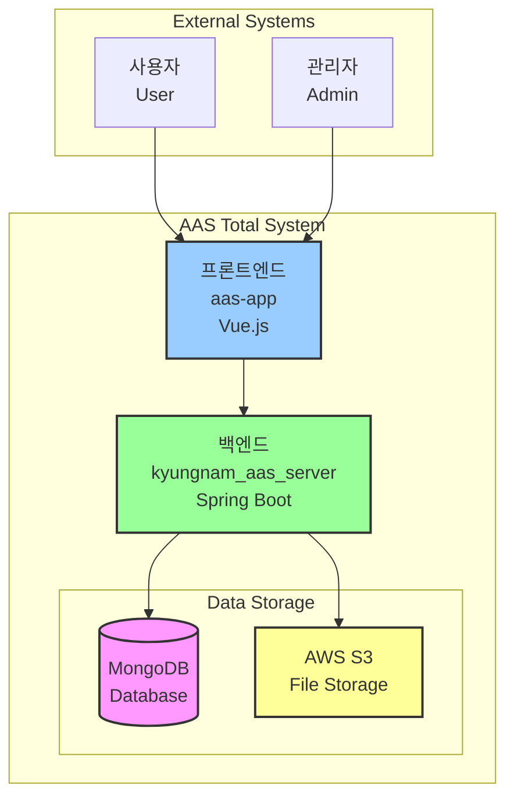
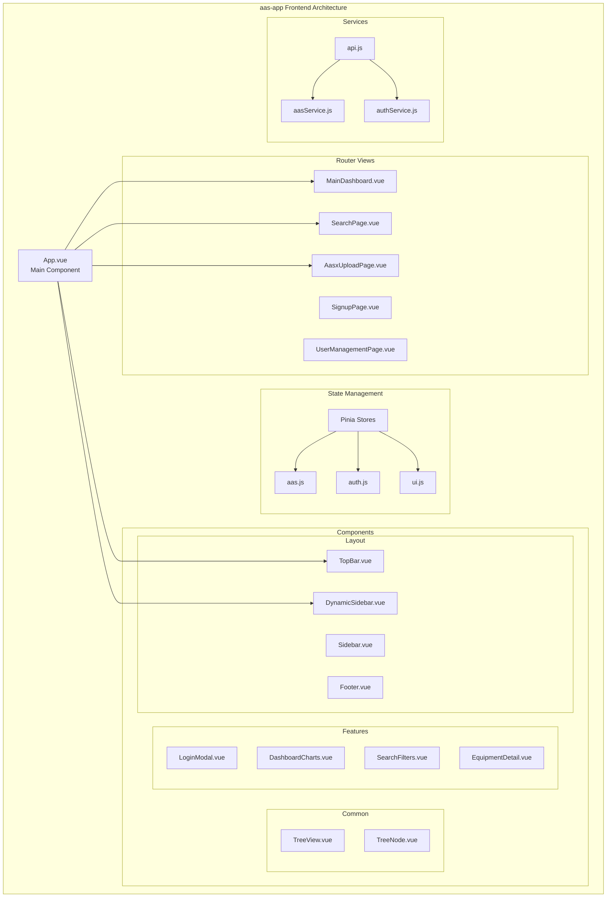
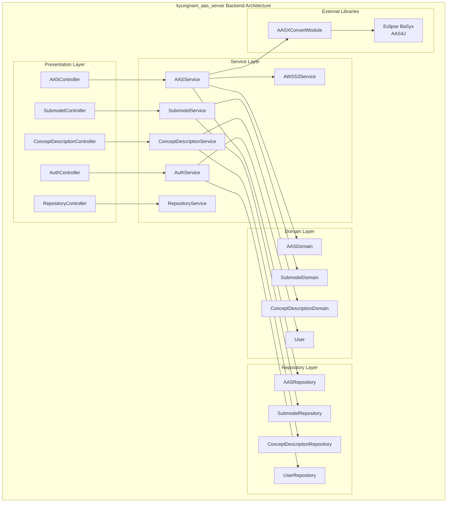
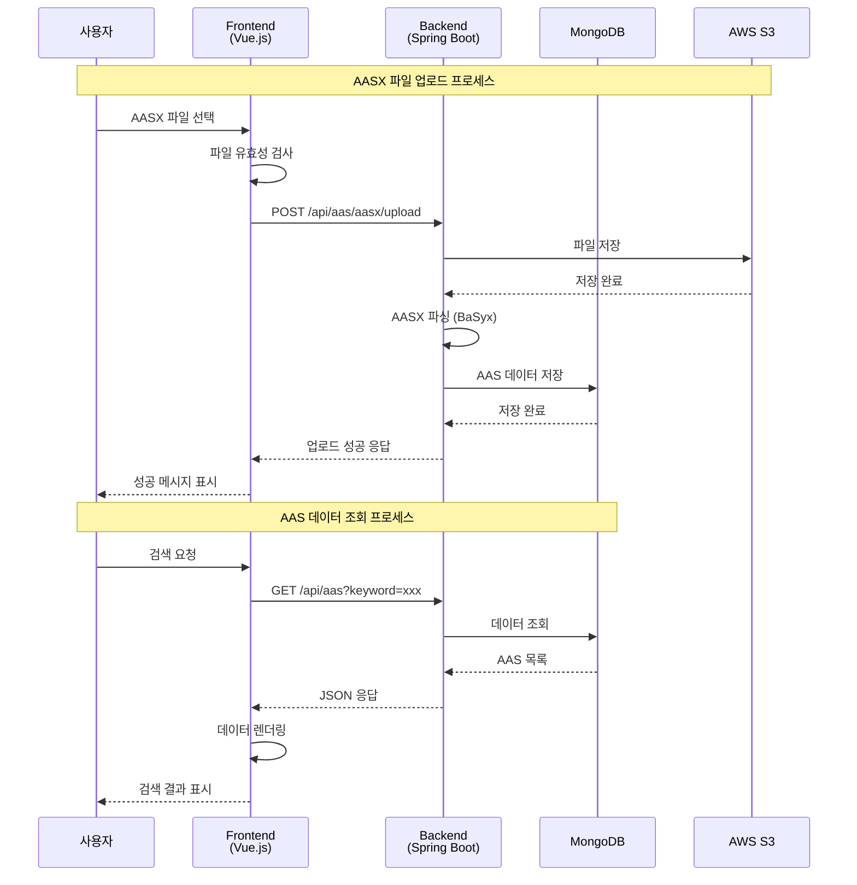
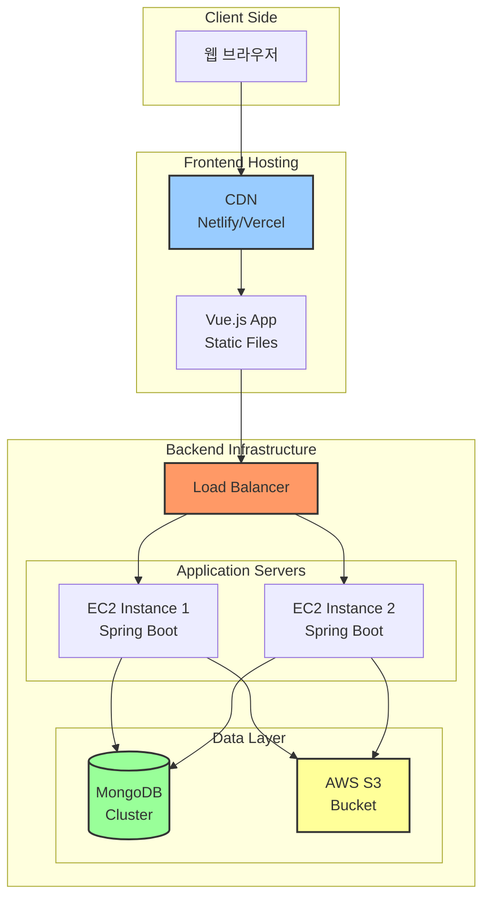
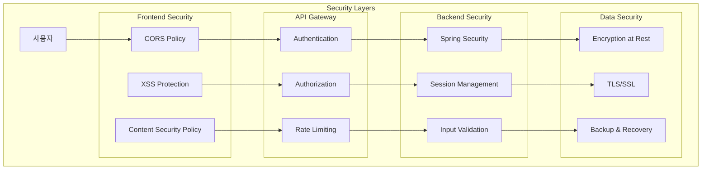
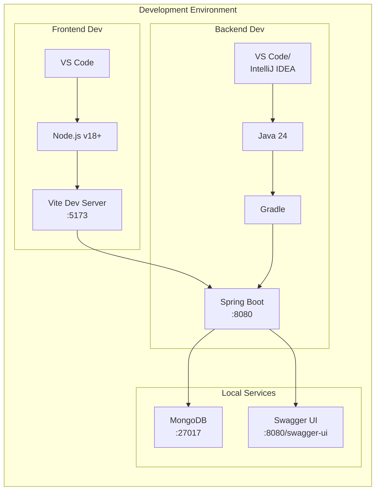
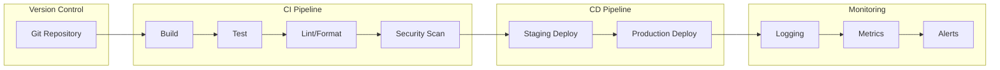

# AAS 시스템 아키텍처 다이어그램

## 1. 시스템 전체 구조도 (C4 Model - Context Diagram)

## 2. 프론트엔드 컴포넌트 구조도

## 3. 백엔드 레이어 아키텍처

## 4. 데이터 플로우 다이어그램

## 5. 배포 아키텍처

## 6. 보안 아키텍처

## 7. 개발 환경 구성도

## 8. CI/CD 파이프라인

---

이 다이어그램들은 AAS 통합 시스템의 전체적인 구조와 각 컴포넌트 간의 관계를 시각적으로 표현합니다. Mermaid 문법을 지원하는 마크다운 뷰어에서 다이어그램이 렌더링됩니다.