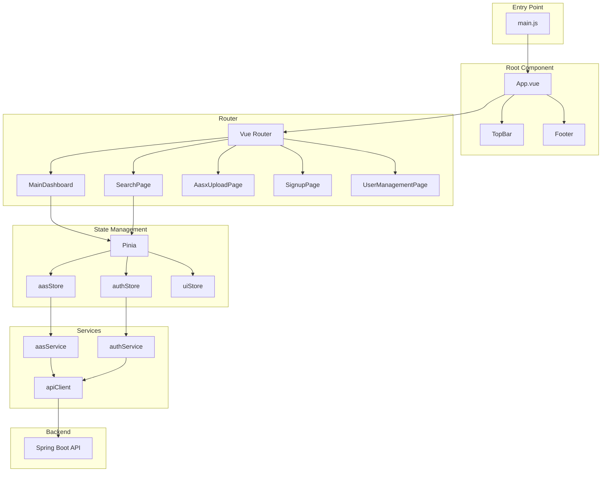

# AAS-App 프론트엔드 상세 분석 문서

## 1. 프로젝트 개요

### 1.1 기본 정보
- **프로젝트명**: aas-app
- **프레임워크**: Vue.js 3.5.13
- **빌드 도구**: Vite 6.2.4
- **패키지 매니저**: npm
- **개발 언어**: JavaScript (ES6+)

### 1.2 프로젝트 목적
Vue.js 기반의 SPA(Single Page Application)로 AAS(Asset Administration Shell) 데이터를 시각화하고 관리하는 웹 애플리케이션

## 2. 프로젝트 구조 분석

### 2.1 디렉토리 구조
```
aas-app/
├── src/
│   ├── App.vue                 # 루트 컴포넌트
│   ├── main.js                 # 애플리케이션 진입점
│   ├── assets/                 # 정적 자원 (CSS, 이미지)
│   ├── components/             # 재사용 가능한 Vue 컴포넌트
│   │   ├── auth/              # 인증 관련 컴포넌트
│   │   ├── charts/            # 차트 컴포넌트
│   │   ├── common/            # 공통 컴포넌트
│   │   ├── icons/             # 아이콘 컴포넌트
│   │   ├── layout/            # 레이아웃 컴포넌트
│   │   └── search/            # 검색 관련 컴포넌트
│   ├── composables/            # Vue Composition API 함수
│   ├── data/                   # 목업 데이터
│   ├── router/                 # Vue Router 설정
│   ├── services/               # API 서비스 레이어
│   ├── stores/                 # Pinia 상태 관리
│   ├── utils/                  # 유틸리티 함수
│   └── views/                  # 페이지 컴포넌트
├── public/                     # 정적 파일
├── docs/                       # 프로젝트 문서
└── 설정 파일들                  # package.json, vite.config.js 등
```

### 2.2 핵심 설정 파일

#### 2.2.1 package.json 주요 의존성
```json
{
  "dependencies": {
    "@fortawesome/fontawesome-free": "^6.7.2",  // 아이콘
    "axios": "^1.9.0",                          // HTTP 클라이언트
    "bootstrap": "^5.3.0",                      // CSS 프레임워크
    "chart.js": "^4.5.0",                       // 차트 라이브러리
    "pinia": "^3.0.1",                          // 상태 관리
    "vue": "^3.5.13",                           // Vue 프레임워크
    "vue-chartjs": "^5.3.2",                    // Vue용 Chart.js 래퍼
    "vue-router": "^4.5.0"                      // 라우팅
  }
}
```

#### 2.2.2 Vite 설정 (vite.config.js)
```javascript
{
  base: './',                                   // 상대 경로 사용
  server: {
    proxy: {
      '/api': {
        target: 'http://15.164.151.83',        // 백엔드 서버 주소
        changeOrigin: true,
        rewrite: (path) => path.replace(/^\/api/, '')
      }
    }
  }
}
```

## 3. 아키텍처 분석

### 3.1 애플리케이션 구조



### 3.2 컴포넌트 계층 구조

#### 3.2.1 App.vue (루트 컴포넌트)
```vue
<template>
  <div class="app-container">
    <TopBar />                          <!-- 상단 네비게이션 -->
    <div class="page-content-wrapper">
      <router-view>                     <!-- 라우터 뷰 -->
        <!-- 페이지 전환 애니메이션 -->
      </router-view>
    </div>
    <AppFooter />                       <!-- 하단 푸터 -->
  </div>
</template>
```

주요 특징:
- 전체 레이아웃 구조 정의
- 페이지 전환 애니메이션 (fade)
- 반응형 레이아웃 (100vh, 100vw)

### 3.3 라우팅 구조

```javascript
routes: [
  { path: '/', component: MainDashboard },        // 대시보드
  { path: '/search', component: SearchPage },     // 검색 페이지
  { path: '/signup', component: SignupPage },     // 회원가입
  { path: '/users', component: UserManagementPage } // 사용자 관리
]
```

## 4. 상태 관리 (Pinia)

### 4.1 AAS Store (aas.js)

#### 상태 구조
```javascript
{
  // 데이터
  aasList: [],                    // AAS 목록
  submodelsList: [],              // Submodel 목록
  conceptDescriptionsList: [],    // ConceptDescription 목록
  selectedAas: null,              // 선택된 AAS
  selectedSubmodel: null,         // 선택된 Submodel
  
  // UI 상태
  isLoading: false,               // 로딩 상태
  error: null,                    // 에러 메시지
  
  // 페이지네이션
  pagination: {
    currentPage: 1,
    totalPages: 1,
    totalCount: 0,
    pageSize: 60,
    hasMore: true
  },
  
  // 검색 필터
  searchFilters: {
    filterType: '',
    filterValue: '',
    keyword: ''
  },
  
  // 통계
  statistics: {
    totalAas: 0,
    totalSubmodels: 0,
    totalConcepts: 0
  }
}
```

#### 주요 액션
1. **fetchAllAAS**: 전체 AAS 조회 (페이징)
2. **fetchAASByKeyword**: 키워드 검색
3. **fetchAllSubmodels**: 전체 Submodel 조회
4. **fetchSubmodelsByAASId**: 특정 AAS의 Submodel 조회
5. **searchByFilter**: 필터 기반 검색
6. **fetchDashboardStatistics**: 대시보드 통계 조회

### 4.2 Auth Store (auth.js)

#### 상태 구조
```javascript
{
  user: null,           // 현재 사용자 정보
  isLoading: false,     // 로딩 상태
  error: null          // 에러 메시지
}
```

#### 주요 기능
- 세션 기반 인증 (쿠키 사용)
- 로그인/로그아웃
- 회원가입
- 인증 상태 확인

## 5. API 서비스 레이어

### 5.1 API Client 설정 (api.js)
```javascript
const apiClient = axios.create({
  baseURL: '/api',              // 프록시 경로
  timeout: 120000,              // 2분 타임아웃
  withCredentials: true,        // 쿠키 포함
  headers: {
    'Content-Type': 'application/json',
    Accept: 'application/json'
  }
})
```

### 5.2 AAS Service (aasService.js)

#### API 엔드포인트 매핑
| 기능 | 메소드 | 엔드포인트 |
|------|--------|------------|
| AAS 목록 조회 | GET | `/aas?page={page}&keyword={keyword}` |
| AAS 상세 조회 | GET | `/aas/{aasId}` |
| AAS 삭제 | DELETE | `/aas/{aasId}` |
| Submodel 조회 | GET | `/aas/submodel/{aasId}` |
| AASX 업로드 | POST | `/aas/aasx/upload` |
| 검색 | GET | `/repository/search/{filterType}?value={value}` |

#### 주요 특징
- URL 인코딩 처리
- 에러 핸들링
- 콘솔 로깅
- Component 필터링 (idShort !== 'Component')

## 6. 주요 컴포넌트 분석

### 6.1 레이아웃 컴포넌트

#### TopBar.vue
- 상단 네비게이션 바
- 로그인/로그아웃 버튼
- 메뉴 네비게이션

#### DynamicSidebar.vue
- 동적 사이드바 메뉴
- 카테고리별 필터링
- 트리 구조 표시

### 6.2 페이지 컴포넌트

#### MainDashboard.vue
- 통계 카드 (AAS, Submodel, ConceptDescription 수)
- 빠른 필터 버튼
- 검색 입력창
- 액션 카드 (Equipment, Material, Process, Upload)

#### SearchPage.vue
- 동적 사이드바
- 검색 결과 표시
- 필터링 옵션
- 상세 정보 모달

### 6.3 공통 컴포넌트

#### TreeView.vue / TreeNode.vue
- 재귀적 트리 구조 렌더링
- 확장/축소 기능
- 클릭 이벤트 처리

## 7. 스타일링 및 UI/UX

### 7.1 CSS 프레임워크
- Bootstrap 5.3.0 사용
- Font Awesome 6.7.2 아이콘

### 7.2 디자인 특징
- 반응형 디자인
- 그라디언트 효과
- 호버 애니메이션
- 페이지 전환 효과

### 7.3 색상 팔레트
```css
--primary: #667eea;
--secondary: #764ba2;
--success: #48bb78;
--warning: #f6ad55;
--danger: #e74c3c;
--background: #f5f7fa;
```

## 8. 성능 최적화

### 8.1 구현된 최적화
- 페이징 처리 (60개씩)
- 컴포넌트 레이지 로딩 가능
- 프록시를 통한 CORS 해결

### 8.2 추가 최적화 가능 영역
- 이미지 최적화
- 코드 스플리팅
- 캐싱 전략
- Virtual Scrolling (대용량 리스트)

## 9. 보안 고려사항

### 9.1 구현된 보안
- 세션 기반 인증
- HTTPS 사용 권장
- XSS 방지 (Vue 자동 이스케이핑)

### 9.2 추가 보안 권장사항
- CSP(Content Security Policy) 헤더
- 입력값 검증 강화
- API Rate Limiting

## 10. 개발 및 빌드

### 10.1 개발 명령어
```bash
npm install     # 의존성 설치
npm run dev     # 개발 서버 실행 (http://localhost:5173)
npm run build   # 프로덕션 빌드
npm run preview # 빌드 결과 미리보기
npm run lint    # ESLint 실행
npm run format  # Prettier 포맷팅
```

### 10.2 환경 설정
- 개발 서버: Vite Dev Server
- 프록시 설정: /api → http://15.164.151.83
- 빌드 출력: dist 디렉토리

## 11. 주요 기능 흐름

### 11.1 AAS 데이터 조회 흐름
1. 사용자가 대시보드/검색 페이지 접속
2. 컴포넌트 마운트 시 store 액션 호출
3. aasService를 통해 API 요청
4. 백엔드에서 데이터 수신
5. store 상태 업데이트
6. 컴포넌트 리렌더링

### 11.2 AASX 파일 업로드 흐름
1. 파일 선택
2. FormData 생성
3. API 요청 (/api/aas/aasx/upload)
4. 서버에서 파싱 및 저장
5. 성공/실패 피드백

## 12. 문제점 및 개선 사항

### 12.1 현재 문제점
- 하드코딩된 백엔드 주소 (15.164.151.83)
- 일부 미구현 기능
- 에러 처리 일관성 부족

### 12.2 개선 제안
- 환경 변수를 통한 설정 관리
- 타입스크립트 도입
- 테스트 코드 작성
- 국제화(i18n) 지원

---

이 문서는 aas-app 프론트엔드 프로젝트의 현재 상태를 상세히 분석한 것입니다. 지속적인 개발과 함께 업데이트가 필요합니다.