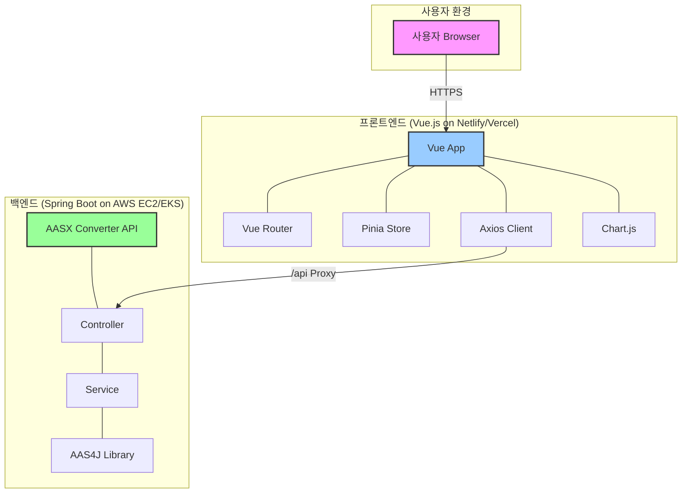

# AAS-App 전체 아키텍처

## 시스템 구성도 (C4 모델 - Level 2)

## 구성 요소 설명

### 1. 사용자 (User)
- 웹 브라우저를 통해 AAS-App 프론트엔드에 접속하여 서비스를 이용합니다.

### 2. 프론트엔드 (Frontend)
- **기술 스택**: Vue.js 3, Vite, Vue Router, Pinia
- **역할**:
    - 사용자 인터페이스(UI) 제공
    - 상태 관리 (Pinia) 및 라우팅 (Vue Router)
    - 데이터 시각화 (Chart.js)
    - 백엔드 API와 비동기 통신 (Axios)
- **배포**: Netlify, Vercel 또는 유사한 정적 호스팅 플랫폼에 배포될 수 있습니다.

### 3. 백엔드 (Backend)
- **기술 스택**: Spring Boot, Java 17, Maven, Eclipse AAS4J
- **역할**:
    - AASX 파일 업로드 및 유효성 검사
    - Eclipse AAS4J 라이브러리를 사용하여 AASX 파일을 JSON으로 변환
    - 변환된 JSON 데이터를 프론트엔드에 API 형태로 제공
- **배포**: AWS EC2, EKS(Kubernetes) 등 클라우드 서버 환경에 배포될 수 있습니다.

## 데이터 흐름 (AASX 파일 변환)

1.  **사용자**가 브라우저에서 `.aasx` 파일을 선택하고 업로드 버튼을 클릭합니다.
2.  **프론트엔드 (Vue App)**는 Axios를 사용하여 `/api/upload` 엔드포인트로 파일 업로드 요청을 보냅니다.
3.  Vite 개발 서버의 **프록시** 설정에 따라, 이 요청은 **백엔드 (AASX Converter API)**의 `http://15.164.151.83/upload`로 전달됩니다.
4.  백엔드의 **Controller**는 요청을 받아 파일을 **Service** 계층으로 전달합니다.
5.  **Service**는 **AAS4J 라이브러리**를 이용해 `.aasx` 파일을 파싱하고 JSON으로 변환합니다.
6.  변환된 JSON 데이터는 **Controller**를 통해 **프론트엔드**로 응답됩니다.
7.  **프론트엔드**는 수신한 JSON 데이터를 사용하여 UI(차트, 트리 뷰 등)를 렌더링합니다.