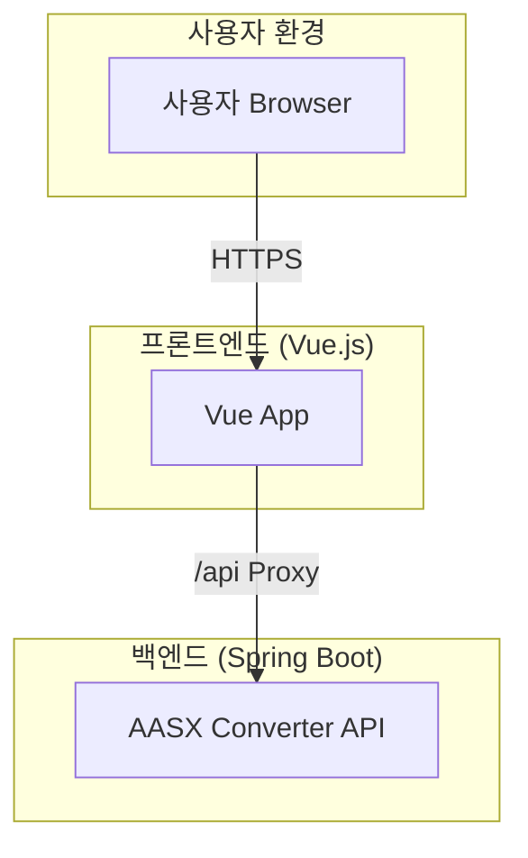

# AAS-App 프로젝트 구조 분석 및 개선 방안 최종 보고서

## 1. 개요

본 보고서는 AAS-App 프로젝트의 현재 시스템 아키텍처를 분석하고, 향후 확장성, 안정성, 유지보수성을 향상시키기 위한 개선 방안을 제안하는 것을 목적으로 합니다. 분석 범위는 프론트엔드(Vue.js)와 백엔드(Spring Boot) 애플리케이션을 포함합니다.

## 2. 현황 분석

### 2.1. 프론트엔드 (Vue.js)
- **기술 스택**: Vue 3, Vite, Vue Router, Pinia, Axios, Chart.js, Bootstrap
- **구조**: Vite 기반의 최신 SPA(Single Page Application) 구조. 컴포넌트가 기능별(auth, charts, layout 등)로 잘 모듈화되어 있음.
- **특징**: Pinia를 통한 상태 관리, Vue Router를 통한 페이지 라우팅, Axios를 이용한 백엔드 API 통신 등 Vue 생태계의 모범 사례를 따르고 있음.

### 2.2. 백엔드 (Spring Boot)
- **기술 스택**: Spring Boot, Java 17, Maven, Eclipse AAS4J, Thymeleaf
- **구조**: AASX 파일을 JSON으로 변환하는 단일 목적의 마이크로서비스. Controller-Service의 2계층 아키텍처로 책임이 명확하게 분리되어 있음.
- **특징**: Eclipse AAS4J 라이브러리를 활용하여 핵심 비즈니스 로직(AASX 변환)을 안정적으로 처리함.

## 3. 전체 아키텍처

### 3.1. 시스템 구성도
(상세 내용은 `architecture.md` 참조)

### 3.2. 데이터 흐름 (AASX 파일 변환)
1.  **사용자**가 브라우저에서 `.aasx` 파일을 업로드합니다.
2.  **프론트엔드**는 백엔드 API(`/api/upload`)로 파일 전송을 요청합니다.
3.  **백엔드**는 요청을 받아 AASX 파일을 JSON으로 변환합니다.
4.  변환된 JSON 데이터는 **프론트엔드**로 응답됩니다.
5.  **프론트엔드**는 수신한 데이터를 사용하여 UI를 렌더링합니다.

## 4. 개선 방안 제안

(상세 내용은 `improvement_plan.md` 참조)

아래는 제안된 개선 방안들을 우선순위에 따라 정리한 것입니다.

| 우선순위 | 영역 | 개선 항목 | 기대 효과 |
| :--- | :--- | :--- | :--- |
| **High** | 백엔드 | DTO 도입 및 전역 예외 처리 | 코드 안정성 및 명확성 증대 |
| **High** | 백엔드 | Swagger API 문서 자동화 | 협업 효율성 증대 |
| **High** | 공통 | CI/CD 파이프라인 구축 | 개발 생산성 및 배포 안정성 확보 |
| **Medium** | 프론트엔드 | 상태 관리(Pinia) 및 API 서비스 모듈화 | 유지보수성 및 확장성 향상 |
| **Medium** | 공통 | 컨테이너화 (Docker) | 개발-운영 환경 일치, 배포 용이성 |
| **Medium** | 백엔드 | 비동기 처리 도입 | 대용량 파일 처리 시 UX 개선 |
| **Low** | 프론트엔드 | 컴포넌트 테스트 도입 | 코드 신뢰도 향상 |
| **Low** | 프론트엔드 | TypeScript 도입 | 장기적인 안정성 및 유지보수성 확보 |

## 5. 결론

AAS-App 프로젝트는 최신 기술 스택을 기반으로 프론트엔드와 백엔드가 명확하게 분리된 잘 설계된 구조를 가지고 있습니다. 현재 구조는 초기 개발 단계에서 매우 효율적이지만, 프로젝트가 성장함에 따라 발생할 수 있는 확장성 및 유지보수성 문제를 예방하기 위해 본 보고서에서 제안된 개선 방안들을 단계적으로 도입할 것을 권장합니다.

특히, **백엔드의 DTO 도입**과 **API 문서 자동화**, 그리고 **CI/CD 파이프라인 구축**을 최우선 과제로 선정하여 진행한다면 단기적으로 가장 큰 효율성 증대를 기대할 수 있습니다.