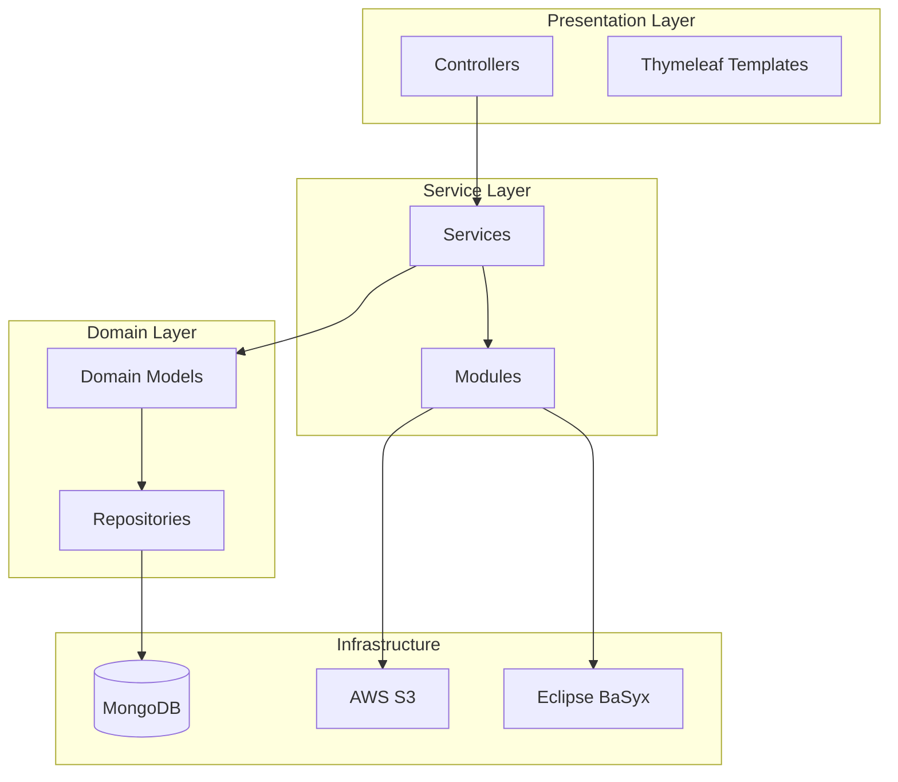
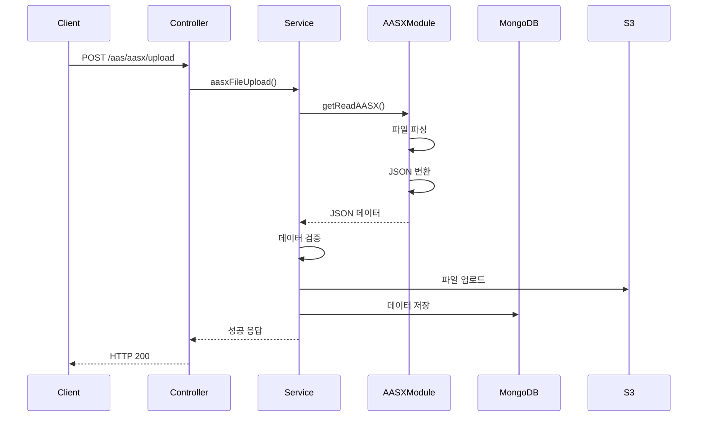

# Kyungnam AAS Server 백엔드 상세 분석 문서

## 1. 프로젝트 개요

### 1.1 기본 정보
- **프로젝트명**: kyungnam_aas_server
- **프레임워크**: Spring Boot 3.4.5
- **빌드 도구**: Gradle
- **개발 언어**: Java 24
- **데이터베이스**: MongoDB
- **파일 스토리지**: AWS S3

### 1.2 프로젝트 목적
Eclipse BaSyx AAS4J를 활용하여 AASX 파일을 파싱하고, AAS(Asset Administration Shell) 데이터를 관리하는 RESTful API 서버

## 2. 프로젝트 구조 분석

### 2.1 디렉토리 구조
```
kyungnam_aas_server/
├── src/
│   ├── main/
│   │   ├── java/org/kyungnam/aas/
│   │   │   ├── config/              # 설정 클래스
│   │   │   │   ├── DataInitializer.java
│   │   │   │   ├── SecurityConfig.java
│   │   │   │   └── SwaggerConfig.java
│   │   │   ├── controller/          # REST 컨트롤러
│   │   │   │   ├── aas/            # AAS 관련
│   │   │   │   ├── admin/          # 관리자 관련
│   │   │   │   ├── auth/           # 인증 관련
│   │   │   │   ├── ConceptDescription/
│   │   │   │   ├── registry/       # 레지스트리
│   │   │   │   ├── repository/     # 레포지토리
│   │   │   │   └── Submodel/       # 서브모델
│   │   │   ├── domain/              # 도메인 모델
│   │   │   │   ├── aas/
│   │   │   │   ├── common/
│   │   │   │   ├── ConceptDescription/
│   │   │   │   ├── submodel/
│   │   │   │   ├── submoelElement/
│   │   │   │   └── user/
│   │   │   ├── module/              # 모듈
│   │   │   │   ├── config/         # AWS 설정
│   │   │   │   └── convert/        # AASX 변환
│   │   │   └── common/              # 공통 클래스
│   │   │       ├── response/       # 응답 포맷
│   │   │       ├── service/        # 공통 서비스
│   │   │       └── utils/          # 유틸리티
│   │   └── resources/
│   │       ├── application.yml      # 애플리케이션 설정
│   │       └── templates/           # Thymeleaf 템플릿
├── build.gradle                     # Gradle 빌드 설정
└── public/                          # 정적 파일
    └── different/                   # 검증 실패 파일 저장
```

### 2.2 핵심 설정 파일

#### 2.2.1 build.gradle 주요 의존성
```gradle
dependencies {
    // Spring Boot
    implementation 'org.springframework.boot:spring-boot-starter-web'
    implementation 'org.springframework.boot:spring-boot-starter-web-services'
    implementation 'org.springframework.boot:spring-boot-starter-thymeleaf'
    implementation 'org.springframework.boot:spring-boot-starter-data-mongodb'
    
    // Eclipse BaSyx AAS4J
    implementation 'org.eclipse.digitaltwin.basyx:basyx.aasrepository-core:2.0.0-milestone-05'
    implementation 'org.eclipse.digitaltwin.basyx:basyx.submodelrepository-core:2.0.0-milestone-05'
    implementation 'org.eclipse.digitaltwin.basyx:basyx.aasenvironment-core:2.0.0-milestone-05'
    
    // AWS
    implementation 'io.awspring.cloud:spring-cloud-aws-starter:3.1.1'
    implementation 'software.amazon.awssdk:s3:2.25.7'
    
    // 기타
    implementation 'org.projectlombok:lombok'
    implementation 'com.fasterxml.jackson.core:jackson-databind:2.18.3'
    implementation 'org.springdoc:springdoc-openapi-starter-webmvc-ui:2.5.0'
}
```

#### 2.2.2 application.yml 설정
```yaml
spring:
  data:
    mongodb:
      uri: mongodb://localhost:27017/aasdb
  servlet:
    multipart:
      max-file-size: 100MB
      max-request-size: 100MB

server:
  port: 8080
```

## 3. 아키텍처 분석

### 3.1 레이어드 아키텍처



### 3.2 주요 컴포넌트 분석

#### 3.2.1 Controller Layer

**AASController.java**
```java
@Controller
@RequestMapping("/aas")
public class AASController {
    // 주요 엔드포인트
    - GET /aas                    // 전체 AAS 조회 (페이징, 키워드)
    - GET /aas/{aasId}           // 특정 AAS 조회
    - DELETE /aas/{aasId}        // AAS 삭제
    - GET /aas/submodel/{aasId}  // AAS의 서브모델 조회
    - POST /aas/aasx/upload      // AASX 파일 업로드
    - DELETE /aas/all/delete     // 전체 AAS 삭제
}
```

**특징**:
- Base64 인코딩된 ID 처리
- 페이징 처리 (기본 10개)
- 파일 업로드 지원

#### 3.2.2 Service Layer

**AASService.java 주요 기능**
1. **AASX 파일 처리**
   - 파일 업로드 및 검증
   - Eclipse BaSyx를 통한 파싱
   - JSON 변환 및 저장

2. **데이터 검증**
   - AAS, Submodel, ConceptDescription 검증
   - 불일치 시 파일로 저장 (`./public/different/`)

3. **데이터 저장**
   - MongoDB 저장
   - AWS S3 파일 업로드
   - 중복 ID 처리 (UUID 추가)

#### 3.2.3 Domain Layer

**AASDomain.java**
```java
@Document(collection = "aas")
public class AASDomain {
    @Id
    private String id;
    private String idShort;
    private Map<String, Object> assetInformation;
    private List<Map<String, Object>> submodel;
}
```

**SubmodelDomain.java**
```java
@Document(collection = "submodel")
public class SubmodelDomain {
    @Id
    private String id;
    private String idShort;
    private String kind;
    private Map<String, Object> semanticId;
    private List<Map<String, Object>> submodelElements;
}
```

**ConceptDescriptionDomain.java**
```java
@Document(collection = "conceptDescription")
public class ConceptDescriptionDomain {
    @Id
    private String id;
    private String idShort;
    private List<Map<String, Object>> embeddedDataSpecifications;
}
```

### 3.3 핵심 모듈 분석

#### 3.3.1 AASXConvertModule

**주요 기능**:
1. AASX 파일 역직렬화
2. AAS Environment 추출
3. JSON 변환 및 포맷팅
4. BOM(Byte Order Mark) 처리

**처리 흐름**:
```
AASX 파일 → XmlDeserializer → Environment → 
→ AAS/Submodel/ConceptDescription 추출 → 
→ JSON 변환 → MongoDB 저장
```

#### 3.3.2 AWSS3Service

**기능**:
- 파일 업로드
- S3 버킷 관리
- URL 생성

### 3.4 보안 설정

**SecurityConfig.java**
```java
@Configuration
public class SecurityConfig {
    // 특징
    - CSRF 비활성화 (REST API)
    - 세션 기반 인증
    - BCrypt 패스워드 인코딩
    - 인증 필요 경로: /auth/logout, /auth/me
    - 인증 불필요: /auth/login, /auth/signup
}
```

## 4. API 엔드포인트 상세

### 4.1 AAS 관련 API

| 엔드포인트 | 메소드 | 설명 | 파라미터 |
|-----------|--------|------|----------|
| `/aas` | GET | AAS 목록 조회 | page, keyword |
| `/aas/{aasId}` | GET | AAS 상세 조회 | aasId (Base64) |
| `/aas/{aasId}` | DELETE | AAS 삭제 | aasId (Base64) |
| `/aas/submodel/{aasId}` | GET | 서브모델 조회 | aasId (Base64) |
| `/aas/aasx/upload` | POST | AASX 업로드 | adminId, files |

### 4.2 Repository 검색 API

**동적 검색 지원**:
```java
// 단일 필드 검색
GET /repository/search/{field}?value={value}

// 중첩 필드 검색 (점 표기법)
GET /repository/search/{field1}/{field2}?value={value}

// 예시
GET /repository/search/ratedfrequency?value=50
GET /repository/search/inputcapacity/kw?value=10
```

### 4.3 응답 포맷

**성공 응답 (SuccessResponse)**:
```json
{
    "status": "success",
    "code": 200,
    "message": {데이터},
    "totalCount": 100  // 페이징 시
}
```

**실패 응답 (FailResponse)**:
```json
{
    "status": "fail",
    "code": 404,
    "message": "에러 메시지"
}
```

## 5. 데이터 처리 흐름

### 5.1 AASX 파일 업로드 프로세스



### 5.2 데이터 검증 프로세스

1. **AAS 검증**
   - ID, idShort 확인
   - AssetInformation 검증
   - Submodel Reference 검증

2. **Submodel 검증**
   - SemanticId 검증
   - SubmodelElement 검증
   - 타입 변환 (xs:string → string)

3. **ConceptDescription 검증**
   - EmbeddedDataSpecification 검증
   - 다국어 지원 확인

## 6. 특징 및 고려사항

### 6.1 장점
1. **표준 준수**: Eclipse BaSyx AAS4J 사용
2. **확장성**: MongoDB의 유연한 스키마
3. **대용량 처리**: 페이징 및 S3 활용
4. **검증 시스템**: 데이터 무결성 보장

### 6.2 개선 필요 사항
1. **트랜잭션 처리**: MongoDB 트랜잭션 미사용
2. **에러 처리**: 일관성 있는 예외 처리 필요
3. **로깅**: 구조화된 로깅 시스템 필요
4. **테스트**: 단위/통합 테스트 부재

### 6.3 보안 고려사항
1. **인증/인가**: 세션 기반 인증 구현
2. **입력 검증**: 파일 크기 제한 (100MB)
3. **CORS**: 프론트엔드 연동 고려 필요

## 7. 성능 최적화

### 7.1 현재 구현
- 페이징 처리 (기본 10개)
- 파일 스트림 처리
- MongoDB 인덱싱 (미구현)

### 7.2 개선 제안
1. **캐싱**: Spring Cache 활용
2. **비동기 처리**: 대용량 파일 업로드
3. **배치 처리**: 다중 파일 처리
4. **인덱싱**: MongoDB 복합 인덱스

## 8. 배포 및 운영

### 8.1 빌드
```bash
./gradlew build
# 출력: build/libs/aas_server.jar
```

### 8.2 실행
```bash
java -jar aas_server.jar
# 또는
./gradlew bootRun
```

### 8.3 환경 설정
- MongoDB 연결 설정
- AWS 자격 증명 설정
- 로그 레벨 설정

## 9. API 문서화

### 9.1 Swagger/OpenAPI
- URL: http://localhost:8080/swagger-ui.html
- API 명세 자동 생성
- 테스트 인터페이스 제공

### 9.2 Thymeleaf 테스트 페이지
- AAS 업로드 테스트
- 삭제 테스트
- 검색 테스트

## 10. 주요 기술적 특징

### 10.1 Eclipse BaSyx 통합
- AAS4J v3 사용
- AASX 역직렬화
- XML → JSON 변환

### 10.2 MongoDB 활용
- 유연한 스키마
- JSON 네이티브 지원
- 대용량 데이터 처리

### 10.3 Spring Boot 3.4.5
- 최신 Java 24 지원
- 반응형 프로그래밍 가능
- 클라우드 네이티브 지원

---

이 문서는 kyungnam_aas_server 백엔드 프로젝트의 현재 상태를 상세히 분석한 것입니다. 지속적인 개발과 함께 업데이트가 필요합니다.